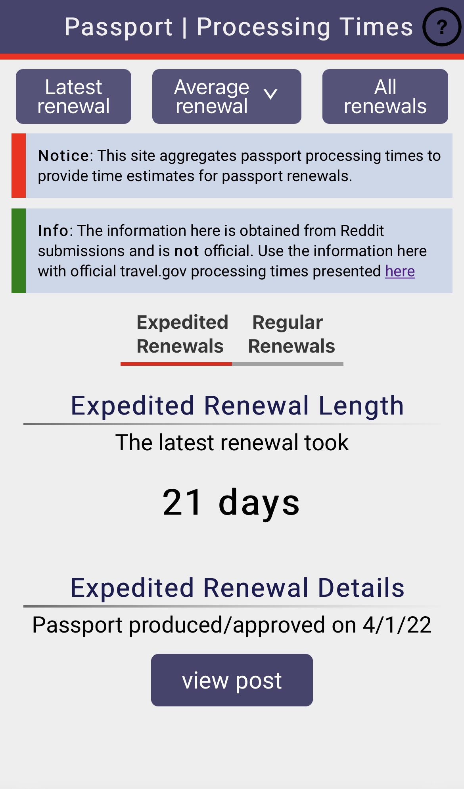

# Link [here](https://passport.tips/)

# passport.tips

Crowdsourced passport renewal time parser written in javascript/react.

This site pulls and parses posts from Reddit(specifically /r/Passports), regarding renewals for passports, processing posts that provide information regarding renewal timelines and length. No more having to manually search pages and pages of posts to gauge current renewal times for passport renewals both expedited and routine.
Additionally, this site presents averages for renewal times in given timeframes to better present processing times and trends.

Please keep in mind that the data parsed here is all crowdsourced from user posts. Therefore, it should be used in **conjunction** with the official [travel.gov](https://travel.state.gov/content/travel/en/passports/how-apply/processing-times.html) to better determine current renewal times.
