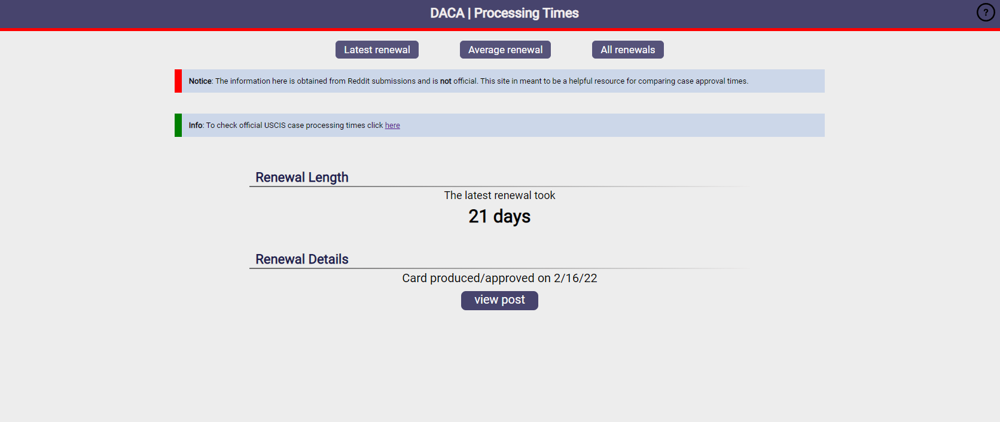

# Link [here](https://daca.one/)

# DacaOne

Crowdsourced USCIS case processing time parser in written in javascript/react.

DacaOne pulls and parses posts from Reddit(specifically /r/DACA), regarding renewals for form I-821D and I-765, processing posts that provide information regarding renewal timelines and length. No more having to manually search pages and pages of posts to gauge current renewal times for form I-821D and I-765 renewals.
Additionally, DacaOne presents averages for renewal times in given timeframes to better present USCIS processing times and trends.

Please keep in mind that the data parsed here is all crowdsourced from user posts. Therefore, it should be used in **conjunction** with the official [USCIS case processing times](https://egov.uscis.gov/processing-times/) to better determine current renewal times.

Due to limitations regarding Reddit's API, only posts from 7 months and earlier are obtained and parsed.
